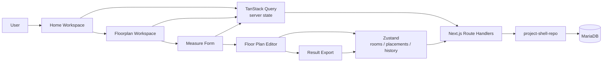
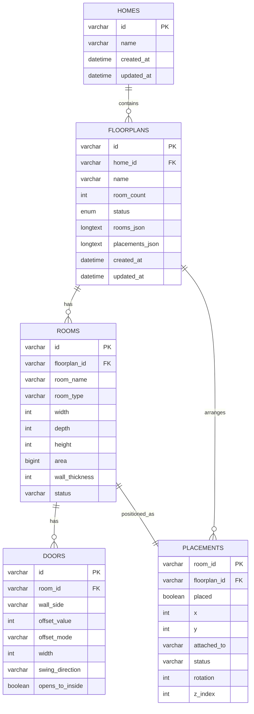

# Room Planner

> 집/도면 워크스페이스에서 방 실측값을 입력하고, 평면을 배치하고, 결과 이미지를 내보내는 Next.js 기반 편집 도구입니다.

  
  
  
  
  
  
  
  

**Room Planner**는 집 단위로 여러 도면을 관리하고, 각 방의 실측 정보와 문의 위치를 입력한 뒤, 캔버스에서 배치와 편집을 거쳐 결과 평면도를 출력하는 프로젝트입니다.

- 집 목록에서 작업 단위를 만들고 검색하고 관리할 수 있습니다.
- 도면별로 방 실측 데이터를 저장하고 자동 저장 기반으로 편집할 수 있습니다.
- 결과 화면에서 치수 요약형과 클린형 렌더 모드, PNG 다운로드, 인쇄 출력을 지원합니다.

## Structure

1. 사용자는 `집 선택 -> 도면 선택 -> 방 측정 -> 평면 편집 -> 결과 보기` 흐름으로 작업합니다.
2. 서버 상태는 TanStack Query, 편집 상태는 Zustand로 분리해서 관리합니다.
3. Next.js Route Handlers가 MariaDB에 도면 문서와 정규화 테이블을 함께 반영합니다.

## ERD

1. `homes`는 상위 작업 단위이며 여러 도면을 묶습니다.
2. `floorplans`는 도면 메타데이터와 상태, 문서형 JSON 스냅샷을 함께 보관합니다.
3. `rooms`, `doors`, `placements`는 실측 데이터와 배치 데이터를 분리해서 저장합니다.

## 기술스택

### Frontend

- Next.js App Router
- React
- TypeScript
- Tailwind CSS
- shadcn/ui
- React Konva

### State / Validation

- TanStack Query
- Zustand
- React Hook Form
- Zod

### Data / Runtime

- Next.js Route Handlers
- MariaDB
- Node.js `>=20.9.0`
- Standalone build (`output: "standalone"`)

## Workflow

| Step | Description |
| --- | --- |
| Home Workspace | 집 생성, 검색, 이름 변경, 삭제 |
| Floorplan Workspace | 도면 생성, 상태 확인, 최근 수정 시각 관리 |
| Measure | 방 이름, 유형, 가로, 세로, 높이, 문 위치, 문 폭, 스윙 방향 입력 |
| Editor | 드래그 배치, 줌, 스냅, 미니맵, 복제, 삭제, Undo / Redo |
| Result | 치수 요약 표시, 클린 출력, PNG 다운로드, 인쇄 |

## 주요 기능

- [x] 집 CRUD 및 집별 도면 허브
- [x] 도면 CRUD 및 상태 관리 (`empty`, `draft`, `complete`)
- [x] 방 실측 입력 폼과 문 위치/문 스윙 설정
- [x] 실시간 방 미리보기
- [x] 캔버스 기반 방 배치와 이동
- [x] 자동 저장
- [x] 스냅 On / Off
- [x] 미니맵 기반 전체 배치 확인
- [x] Undo / Redo
- [x] 방 복제 및 삭제
- [x] 결과 화면 PNG 다운로드
- [x] Standalone 산출물 기반 배포 스크립트 제공